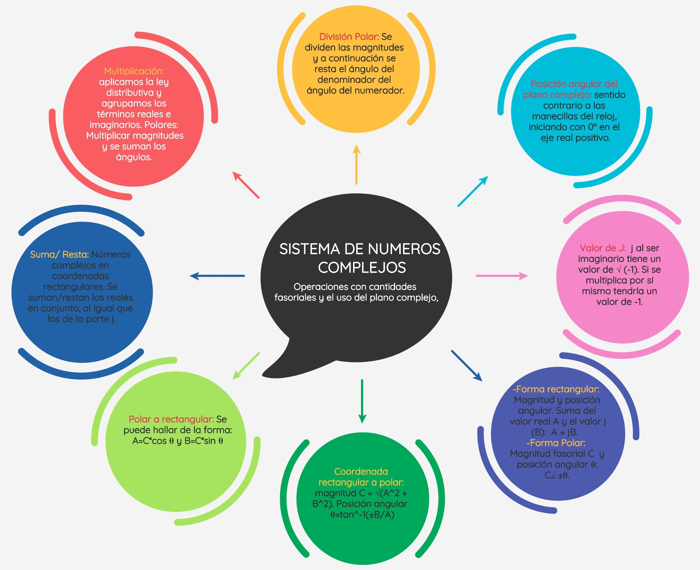
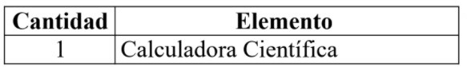

# Informe 7
Informe de Laboratorio N°7

1. OBJETIVOS

_Objetivos Generales_

•  Presentar un desarrollo lógico y secuencial en la resolución de los ejercicios planteados, de acuerdo a la teoría del análisis de numeros complejos y establecer los principales métodos y técnicas del cálculo complejo, de acuerdo a su forma polar y rectangular, asi como  como el uso de herramientas para la resolucion de dichos problemas aplicados a la electrónica, especificamente los circuitos de corriente alterna.   

• 

_Objetivos Específicos_

• Reconocer la estructura analítica de los números complejos y sus operaciones algebraicas para tranformarlos de su forma polar a rectangular, o viceversa.

• Expresar cantidades fasoriales tanto en forma rectangular como en forma polar

• Efectuar conversiones entre las formas rectangular y polar

• Realizar operaciones aritméticas con números complejos

2.MARCO TEÓRICO

3. LISTA DE COMPONENTES

5. EXPLICACIÓN 

![](

6. CONCLUSIONES:

•	

• 

• 

 
7. BIBLIOGRAFÍA

• 

8. Anexos

